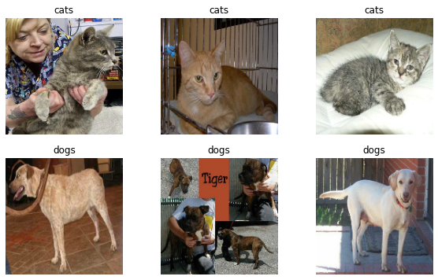
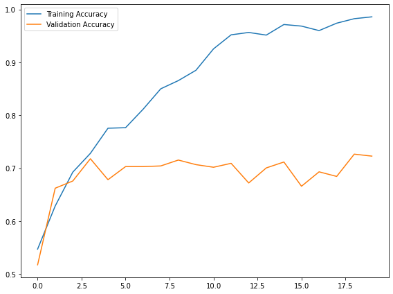
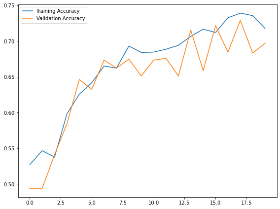
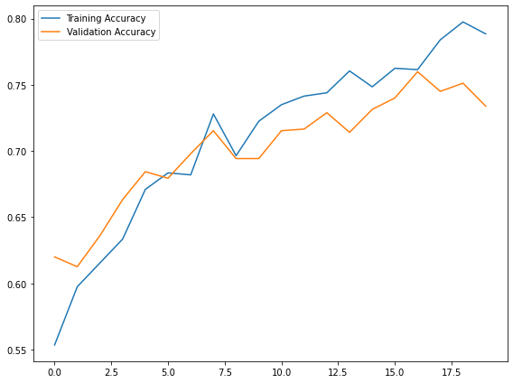
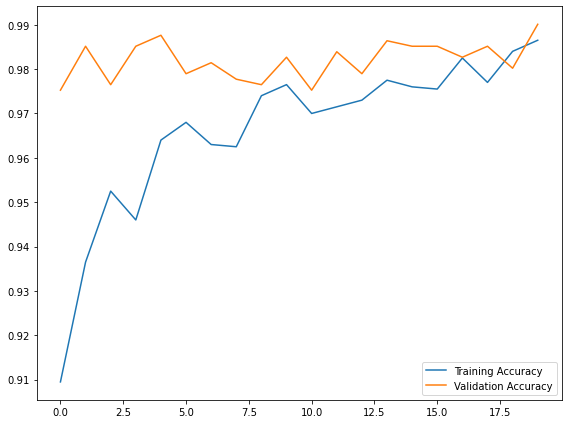

# Image Classification

In this blog post, you will learn several new skills and concepts related to image classification in Tensorflow.

Tensorflow Datasets provide a convenient way for us to organize operations on our training, validation, and test data sets.
Data augmentation allows us to create expanded versions of our data sets that allow models to learn patterns more robustly.
Transfer learning allows us to use pre-trained models for new tasks.
Working on the coding portion of the Blog Post in Google Colab is strongly recommended. When training your model, enabling a GPU runtime (under Runtime -> Change Runtime Type) is likely to lead to significant speed benefits.

# The Task

Can you teach a machine learning algorithm to distinguish between pictures of dogs and pictures of cats?

According to this helpful diagram below, one way to do this is to attend to the visible emotional range of the pet:

## §1. Load Packages and Obtain Data

Start by making a code block in which you’ll hold your import statements. You can update this block as you go. For now, include

```python
import os
import tensorflow as tf
from tensorflow.keras import utils
import matplotlib.pyplot as plt
import pandas as pd
import numpy as np
```

Now, let’s access the data. We’ll use a sample data set provided by the TensorFlow team that contains labeled images of cats and dogs.

Paste and run the following code block.

```python
# location of data
_URL = 'https://storage.googleapis.com/mledu-datasets/cats_and_dogs_filtered.zip'

# download the data and extract it
path_to_zip = utils.get_file('cats_and_dogs.zip', origin=_URL, extract=True)

# construct paths
PATH = os.path.join(os.path.dirname(path_to_zip), 'cats_and_dogs_filtered')

train_dir = os.path.join(PATH, 'train')
validation_dir = os.path.join(PATH, 'validation')

# parameters for datasets
BATCH_SIZE = 32
IMG_SIZE = (160, 160)

# construct train and validation datasets 
train_dataset = utils.image_dataset_from_directory(train_dir,
                                                   shuffle=True,
                                                   batch_size=BATCH_SIZE,
                                                   image_size=IMG_SIZE)

validation_dataset = utils.image_dataset_from_directory(validation_dir,
                                                        shuffle=True,
                                                        batch_size=BATCH_SIZE,
                                                        image_size=IMG_SIZE)

# construct the test dataset by taking every 5th observation out of the validation dataset
val_batches = tf.data.experimental.cardinality(validation_dataset)
test_dataset = validation_dataset.take(val_batches // 5)
validation_dataset = validation_dataset.skip(val_batches // 5)
```

    Found 2000 files belonging to 2 classes.
    Found 1000 files belonging to 2 classes.

By running this code, we have created TensorFlow Datasets for training, validation, and testing. You can think of a Dataset as a pipeline that feeds data to a machine learning model. We use data sets in cases in which it’s not necessarily practical to load all the data into memory.

In our case, we’ve used a special-purpose keras utility called image_dataset_from_directory to construct a Dataset. The most important argument is the first one, which says where the images are located. The shuffle argument says that, when retrieving data from this directory, the order should be randomized. The batch_size determines how many data points are gathered from the directory at once. Here, for example, each time we request some data we will get 32 images from each of the data sets. Finally, the image_size specifies the size of the input images, just like you’d expect.

## Working with Datasets

You can get a piece of a data set using the take method; e.g. train_dataset.take(1) will retrieve one batch (32 images with labels) from the training data.

Let’s briefly explore our data set. We will write a function to create a two-row visualization. In the first row, it shows three random pictures of cats. In the second row, it shows three random pictures of dogs. You can see some related code in the linked tutorial above, although you’ll need to make some modifications in order to separate cats and dogs by rows. A docstring is not required.

```python
class_names = train_dataset.class_names
plt.figure(figsize= (10, 6))
for images, labels in train_dataset.take(1):
    x = 0
    for i in range(len(images)):
        if(x < 3):
            if(class_names[labels[i]] == "cats"):
                ax = plt.subplot(2, 3, x + 1)
                plt.imshow(images[i].numpy().astype("uint8"))
                plt.title(class_names[labels[i]])
                plt.axis("off")
                x += 1
        if(x >= 3):
            if(class_names[labels[i]] == "dogs"):
                ax = plt.subplot(2, 3, x + 1)
                plt.imshow(images[i].numpy().astype("uint8"))
                plt.title(class_names[labels[i]])
                plt.axis("off")
                x += 1
        if(x >= 6):
            break
```


    

    

Paste the following code into the next block. This is technical code related to rapidly reading data. 

```python
AUTOTUNE = tf.data.AUTOTUNE

train_dataset = train_dataset.prefetch(buffer_size=AUTOTUNE)
validation_dataset = validation_dataset.prefetch(buffer_size=AUTOTUNE)
test_dataset = test_dataset.prefetch(buffer_size=AUTOTUNE)
```
### Check Label Frequencies
The first line of code will create an iterator called labels.
This code compute the number of images in the training data with label 0 (corresponding to "cat") and label 1 (corresponding to "dog").

The baseline machine learning model is the model that always guesses the most frequent label. 

We’ll treat this as the benchmark for improvement. Our models should do much better than baseline in order to be considered good data science achievements!

```python
labels_iterator= train_dataset.unbatch().map(tf.autograph.experimental.do_not_convert(lambda image, label: label)).as_numpy_iterator()
catcount, dogcount = 0, 0
for x in labels_iterator:
    if x == 0:
        catcount += 1
    else:
        dogcount += 1
print(catcount)
print(dogcount)
#The baseline model would be accurate 50% of the time
```

    1000
    1000

## §2. First Model
Now, we wil create a tf.keras.Sequential model. In each model, we include at least two Conv2D layers, at least two MaxPooling2D layers, at least one Flatten layer, at least one Dense layer, and at least one Dropout layer. We train the model and plot the history of the accuracy on both the training and validation sets. 

```python
num_classes = 2
model1 = tf.keras.Sequential([
    tf.keras.layers.Rescaling(1./255),
    tf.keras.layers.Conv2D(32, 3, activation='relu'),
    tf.keras.layers.MaxPooling2D(),
    tf.keras.layers.Conv2D(32, 3, activation='relu'),
    tf.keras.layers.MaxPooling2D(),
    tf.keras.layers.Conv2D(32, 3, activation='relu'),
    tf.keras.layers.Dropout(0.5),
    tf.keras.layers.MaxPooling2D(),
    tf.keras.layers.Flatten(),
    tf.keras.layers.Dense(128, activation='relu'),
    tf.keras.layers.Dense(num_classes)
])

model1.compile(
  optimizer='adam',
  loss=tf.losses.SparseCategoricalCrossentropy(from_logits=True),
  metrics=['accuracy'])

history1 = model1.fit(train_dataset, 
                     epochs=20, 
                     validation_data=validation_dataset)
```

    Epoch 1/20
    WARNING:tensorflow:AutoGraph could not transform <function Model.make_train_function.<locals>.train_function at 0x7f9734b78680> and will run it as-is.
    Please report this to the TensorFlow team. When filing the bug, set the verbosity to 10 (on Linux, `export AUTOGRAPH_VERBOSITY=10`) and attach the full output.
    Cause: 'arguments' object has no attribute 'posonlyargs'
    To silence this warning, decorate the function with @tf.autograph.experimental.do_not_convert
    WARNING: AutoGraph could not transform <function Model.make_train_function.<locals>.train_function at 0x7f9734b78680> and will run it as-is.
    Please report this to the TensorFlow team. When filing the bug, set the verbosity to 10 (on Linux, `export AUTOGRAPH_VERBOSITY=10`) and attach the full output.
    Cause: 'arguments' object has no attribute 'posonlyargs'
    To silence this warning, decorate the function with @tf.autograph.experimental.do_not_convert
    63/63 [==============================] - ETA: 0s - loss: 0.7079 - accuracy: 0.5470WARNING:tensorflow:AutoGraph could not transform <function Model.make_test_function.<locals>.test_function at 0x7f972335cef0> and will run it as-is.
    Please report this to the TensorFlow team. When filing the bug, set the verbosity to 10 (on Linux, `export AUTOGRAPH_VERBOSITY=10`) and attach the full output.
    Cause: 'arguments' object has no attribute 'posonlyargs'
    To silence this warning, decorate the function with @tf.autograph.experimental.do_not_convert
    WARNING: AutoGraph could not transform <function Model.make_test_function.<locals>.test_function at 0x7f972335cef0> and will run it as-is.
    Please report this to the TensorFlow team. When filing the bug, set the verbosity to 10 (on Linux, `export AUTOGRAPH_VERBOSITY=10`) and attach the full output.
    Cause: 'arguments' object has no attribute 'posonlyargs'
    To silence this warning, decorate the function with @tf.autograph.experimental.do_not_convert
    63/63 [==============================] - 35s 535ms/step - loss: 0.7079 - accuracy: 0.5470 - val_loss: 0.6774 - val_accuracy: 0.5173
    Epoch 2/20
    63/63 [==============================] - 35s 551ms/step - loss: 0.6524 - accuracy: 0.6285 - val_loss: 0.6267 - val_accuracy: 0.6621
    Epoch 3/20
    63/63 [==============================] - 33s 528ms/step - loss: 0.5786 - accuracy: 0.6925 - val_loss: 0.5996 - val_accuracy: 0.6757
    Epoch 4/20
    63/63 [==============================] - 33s 523ms/step - loss: 0.5231 - accuracy: 0.7280 - val_loss: 0.5706 - val_accuracy: 0.7178
    Epoch 5/20
    63/63 [==============================] - 33s 522ms/step - loss: 0.4772 - accuracy: 0.7755 - val_loss: 0.6102 - val_accuracy: 0.6782
    Epoch 6/20
    63/63 [==============================] - 34s 532ms/step - loss: 0.4682 - accuracy: 0.7765 - val_loss: 0.5785 - val_accuracy: 0.7030
    Epoch 7/20
    63/63 [==============================] - 33s 523ms/step - loss: 0.3899 - accuracy: 0.8115 - val_loss: 0.5788 - val_accuracy: 0.7030
    Epoch 8/20
    63/63 [==============================] - 39s 617ms/step - loss: 0.3351 - accuracy: 0.8500 - val_loss: 0.5841 - val_accuracy: 0.7042
    Epoch 9/20
    63/63 [==============================] - 33s 512ms/step - loss: 0.2985 - accuracy: 0.8655 - val_loss: 0.6399 - val_accuracy: 0.7153
    Epoch 10/20
    63/63 [==============================] - 33s 521ms/step - loss: 0.2528 - accuracy: 0.8850 - val_loss: 0.6150 - val_accuracy: 0.7067
    Epoch 11/20
    63/63 [==============================] - 40s 638ms/step - loss: 0.1931 - accuracy: 0.9255 - val_loss: 0.6555 - val_accuracy: 0.7017
    Epoch 12/20
    63/63 [==============================] - 37s 576ms/step - loss: 0.1419 - accuracy: 0.9520 - val_loss: 0.7351 - val_accuracy: 0.7092
    Epoch 13/20
    63/63 [==============================] - 36s 561ms/step - loss: 0.1245 - accuracy: 0.9565 - val_loss: 0.8713 - val_accuracy: 0.6720
    Epoch 14/20
    63/63 [==============================] - 44s 692ms/step - loss: 0.1324 - accuracy: 0.9515 - val_loss: 0.8127 - val_accuracy: 0.7005
    Epoch 15/20
    63/63 [==============================] - 38s 599ms/step - loss: 0.0940 - accuracy: 0.9715 - val_loss: 0.8818 - val_accuracy: 0.7116
    Epoch 16/20
    63/63 [==============================] - 41s 653ms/step - loss: 0.0905 - accuracy: 0.9685 - val_loss: 0.9293 - val_accuracy: 0.6658
    Epoch 17/20
    63/63 [==============================] - 36s 575ms/step - loss: 0.1072 - accuracy: 0.9600 - val_loss: 0.9416 - val_accuracy: 0.6931
    Epoch 18/20
    63/63 [==============================] - 39s 610ms/step - loss: 0.0716 - accuracy: 0.9740 - val_loss: 0.9191 - val_accuracy: 0.6844
    Epoch 19/20
    63/63 [==============================] - 32s 503ms/step - loss: 0.0475 - accuracy: 0.9825 - val_loss: 0.9916 - val_accuracy: 0.7265
    Epoch 20/20
    63/63 [==============================] - 34s 539ms/step - loss: 0.0430 - accuracy: 0.9860 - val_loss: 0.9663 - val_accuracy: 0.7228

My model stabilized between 68-73% accuracy. This is better than the baseline of 50% accuracy. However, considering the difference between training accuracy(~95%) and validation accuracy(~71%), it is clear
that overfitting occured with this model.

We will now plot the model. 


```python
model_history = pd.DataFrame(history1.history)
model_history['epoch'] = history1.epoch
fig, ax = plt.subplots(1, figsize=(8,6))
num_epochs = model_history.shape[0]

ax.plot(np.arange(0, num_epochs), model_history["accuracy"], 
        label="Training Accuracy")
ax.plot(np.arange(0, num_epochs), model_history["val_accuracy"], 
        label="Validation Accuracy")
ax.legend()
plt.tight_layout()
plt.show()
```
 

    
## §3. Model with Data Augmentation
Now we’re going to add some data augmentation layers to your model. Data augmentation refers to the practice of including modified copies of the same image in the training set. For example, a picture of a cat is still a picture of a cat even if we flip it upside down or rotate it 90 degrees. We can include such transformed versions of the image in our training process in order to help our model learn so-called invariant features of our input images.


```python
model2 = tf.keras.Sequential([
    tf.keras.layers.RandomFlip('horizontal'),
    tf.keras.layers.RandomRotation(0.2),
    tf.keras.layers.Rescaling(1./255),
    tf.keras.layers.Conv2D(32, 3, activation='relu'),
    tf.keras.layers.MaxPooling2D(),
    tf.keras.layers.Conv2D(32, 3, activation='relu'),
    tf.keras.layers.MaxPooling2D(),
    tf.keras.layers.Conv2D(32, 3, activation='relu'),
    tf.keras.layers.Dropout(0.5),
    tf.keras.layers.MaxPooling2D(),
    tf.keras.layers.Flatten(),
    tf.keras.layers.Dense(128, activation='relu'),
    tf.keras.layers.Dense(num_classes)
])
model2.compile(
  optimizer='adam',
  loss=tf.losses.SparseCategoricalCrossentropy(from_logits=True),
  metrics=['accuracy'])

history2 = model2.fit(train_dataset, 
                     epochs=20, 
                     validation_data=validation_dataset)
```

    Epoch 1/20
    WARNING:tensorflow:AutoGraph could not transform <function Model.make_train_function.<locals>.train_function at 0x7f972b7fa170> and will run it as-is.
    Please report this to the TensorFlow team. When filing the bug, set the verbosity to 10 (on Linux, `export AUTOGRAPH_VERBOSITY=10`) and attach the full output.
    Cause: 'arguments' object has no attribute 'posonlyargs'
    To silence this warning, decorate the function with @tf.autograph.experimental.do_not_convert
    WARNING: AutoGraph could not transform <function Model.make_train_function.<locals>.train_function at 0x7f972b7fa170> and will run it as-is.
    Please report this to the TensorFlow team. When filing the bug, set the verbosity to 10 (on Linux, `export AUTOGRAPH_VERBOSITY=10`) and attach the full output.
    Cause: 'arguments' object has no attribute 'posonlyargs'
    To silence this warning, decorate the function with @tf.autograph.experimental.do_not_convert
    63/63 [==============================] - ETA: 0s - loss: 0.7368 - accuracy: 0.5270WARNING:tensorflow:AutoGraph could not transform <function Model.make_test_function.<locals>.test_function at 0x7f972fbddcb0> and will run it as-is.
    Please report this to the TensorFlow team. When filing the bug, set the verbosity to 10 (on Linux, `export AUTOGRAPH_VERBOSITY=10`) and attach the full output.
    Cause: 'arguments' object has no attribute 'posonlyargs'
    To silence this warning, decorate the function with @tf.autograph.experimental.do_not_convert
    WARNING: AutoGraph could not transform <function Model.make_test_function.<locals>.test_function at 0x7f972fbddcb0> and will run it as-is.
    Please report this to the TensorFlow team. When filing the bug, set the verbosity to 10 (on Linux, `export AUTOGRAPH_VERBOSITY=10`) and attach the full output.
    Cause: 'arguments' object has no attribute 'posonlyargs'
    To silence this warning, decorate the function with @tf.autograph.experimental.do_not_convert
    63/63 [==============================] - 41s 625ms/step - loss: 0.7368 - accuracy: 0.5270 - val_loss: 0.7024 - val_accuracy: 0.4938
    Epoch 2/20
    63/63 [==============================] - 38s 604ms/step - loss: 0.6876 - accuracy: 0.5465 - val_loss: 0.6943 - val_accuracy: 0.4938
    Epoch 3/20
    63/63 [==============================] - 36s 570ms/step - loss: 0.6887 - accuracy: 0.5375 - val_loss: 0.6906 - val_accuracy: 0.5408
    Epoch 4/20
    63/63 [==============================] - 37s 588ms/step - loss: 0.6669 - accuracy: 0.5980 - val_loss: 0.6487 - val_accuracy: 0.5842
    Epoch 5/20
    63/63 [==============================] - 35s 560ms/step - loss: 0.6421 - accuracy: 0.6255 - val_loss: 0.6276 - val_accuracy: 0.6460
    Epoch 6/20
    63/63 [==============================] - 38s 597ms/step - loss: 0.6249 - accuracy: 0.6415 - val_loss: 0.6290 - val_accuracy: 0.6324
    Epoch 7/20
    63/63 [==============================] - 45s 712ms/step - loss: 0.6190 - accuracy: 0.6650 - val_loss: 0.6170 - val_accuracy: 0.6733
    Epoch 8/20
    63/63 [==============================] - 39s 611ms/step - loss: 0.6071 - accuracy: 0.6620 - val_loss: 0.6177 - val_accuracy: 0.6621
    Epoch 9/20
    63/63 [==============================] - 38s 605ms/step - loss: 0.5936 - accuracy: 0.6930 - val_loss: 0.5989 - val_accuracy: 0.6745
    Epoch 10/20
    63/63 [==============================] - 39s 610ms/step - loss: 0.5796 - accuracy: 0.6840 - val_loss: 0.6122 - val_accuracy: 0.6510
    Epoch 11/20
    63/63 [==============================] - 41s 653ms/step - loss: 0.5916 - accuracy: 0.6845 - val_loss: 0.5988 - val_accuracy: 0.6733
    Epoch 12/20
    63/63 [==============================] - 48s 762ms/step - loss: 0.5849 - accuracy: 0.6885 - val_loss: 0.5901 - val_accuracy: 0.6757
    Epoch 13/20
    63/63 [==============================] - 40s 634ms/step - loss: 0.5776 - accuracy: 0.6940 - val_loss: 0.6229 - val_accuracy: 0.6510
    Epoch 14/20
    63/63 [==============================] - 44s 695ms/step - loss: 0.5713 - accuracy: 0.7065 - val_loss: 0.5758 - val_accuracy: 0.7153
    Epoch 15/20
    63/63 [==============================] - 36s 563ms/step - loss: 0.5516 - accuracy: 0.7165 - val_loss: 0.6021 - val_accuracy: 0.6584
    Epoch 16/20
    63/63 [==============================] - 37s 578ms/step - loss: 0.5506 - accuracy: 0.7120 - val_loss: 0.5545 - val_accuracy: 0.7215
    Epoch 17/20
    63/63 [==============================] - 39s 615ms/step - loss: 0.5298 - accuracy: 0.7325 - val_loss: 0.6004 - val_accuracy: 0.6844
    Epoch 18/20
    63/63 [==============================] - 43s 682ms/step - loss: 0.5302 - accuracy: 0.7390 - val_loss: 0.5578 - val_accuracy: 0.7290
    Epoch 19/20
    63/63 [==============================] - 39s 619ms/step - loss: 0.5419 - accuracy: 0.7355 - val_loss: 0.5803 - val_accuracy: 0.6832
    Epoch 20/20
    63/63 [==============================] - 39s 617ms/step - loss: 0.5441 - accuracy: 0.7175 - val_loss: 0.5713 - val_accuracy: 0.6968


My model stabilized between 68-73% accuracy. This is pretty similar to model1. However, considering the difference between training accuracy(~72%) and validation accuracy(~71%), it is clear that there was less overfitting with this model.

Now we will plot the accuracy of the model. 

```python
model_history = pd.DataFrame(history2.history)
model_history['epoch'] = history2.epoch
fig, ax = plt.subplots(1, figsize=(8,6))
num_epochs = model_history.shape[0]

ax.plot(np.arange(0, num_epochs), model_history["accuracy"], 
        label="Training Accuracy")
ax.plot(np.arange(0, num_epochs), model_history["val_accuracy"], 
        label="Validation Accuracy")
ax.legend()
plt.tight_layout()
plt.show()
```

    

    
## §4. Data Preprocessing
Sometimes, it can be helpful to make simple transformations to the input data. For example, in this case, the original data has pixels with RGB values between 0 and 255, but many models will train faster with RGB values normalized between 0 and 1, or possibly between -1 and 1. These are mathematically identical situations, since we can always just scale the weights. But if we handle the scaling prior to the training process, we can spend more of our training energy handling actual signal in the data and less energy having the weights adjust to the data scale.

The following code will create a preprocessing layer called preprocessor which we can slot into our model pipeline.


```python
i = tf.keras.Input(shape=(160, 160, 3))
x = tf.keras.applications.mobilenet_v2.preprocess_input(i)
preprocessor = tf.keras.Model(inputs = [i], outputs = [x])

model3 = tf.keras.Sequential([
    preprocessor,
    tf.keras.layers.RandomFlip('horizontal'),
    tf.keras.layers.RandomRotation(0.2),
    tf.keras.layers.Conv2D(32, 3, activation='relu'),
    tf.keras.layers.MaxPooling2D(),
    tf.keras.layers.Conv2D(32, 3, activation='relu'),
    tf.keras.layers.MaxPooling2D(),
    tf.keras.layers.Conv2D(32, 3, activation='relu'),
    tf.keras.layers.Dropout(0.5),
    tf.keras.layers.MaxPooling2D(),
    tf.keras.layers.Flatten(),
    tf.keras.layers.Dense(128, activation='relu'),
    tf.keras.layers.Dense(num_classes)
])
model3.compile(
  optimizer='adam',
  loss=tf.losses.SparseCategoricalCrossentropy(from_logits=True),
  metrics=['accuracy'])

history3 = model3.fit(train_dataset, 
                     epochs=20, 
                     validation_data=validation_dataset)
```

    Epoch 1/20
    WARNING:tensorflow:AutoGraph could not transform <function Model.make_train_function.<locals>.train_function at 0x7f972b7058c0> and will run it as-is.
    Please report this to the TensorFlow team. When filing the bug, set the verbosity to 10 (on Linux, `export AUTOGRAPH_VERBOSITY=10`) and attach the full output.
    Cause: 'arguments' object has no attribute 'posonlyargs'
    To silence this warning, decorate the function with @tf.autograph.experimental.do_not_convert
    WARNING: AutoGraph could not transform <function Model.make_train_function.<locals>.train_function at 0x7f972b7058c0> and will run it as-is.
    Please report this to the TensorFlow team. When filing the bug, set the verbosity to 10 (on Linux, `export AUTOGRAPH_VERBOSITY=10`) and attach the full output.
    Cause: 'arguments' object has no attribute 'posonlyargs'
    To silence this warning, decorate the function with @tf.autograph.experimental.do_not_convert
    63/63 [==============================] - ETA: 0s - loss: 0.7449 - accuracy: 0.5535WARNING:tensorflow:AutoGraph could not transform <function Model.make_test_function.<locals>.test_function at 0x7f972bd27c20> and will run it as-is.
    Please report this to the TensorFlow team. When filing the bug, set the verbosity to 10 (on Linux, `export AUTOGRAPH_VERBOSITY=10`) and attach the full output.
    Cause: 'arguments' object has no attribute 'posonlyargs'
    To silence this warning, decorate the function with @tf.autograph.experimental.do_not_convert
    WARNING: AutoGraph could not transform <function Model.make_test_function.<locals>.test_function at 0x7f972bd27c20> and will run it as-is.
    Please report this to the TensorFlow team. When filing the bug, set the verbosity to 10 (on Linux, `export AUTOGRAPH_VERBOSITY=10`) and attach the full output.
    Cause: 'arguments' object has no attribute 'posonlyargs'
    To silence this warning, decorate the function with @tf.autograph.experimental.do_not_convert
    63/63 [==============================] - 50s 778ms/step - loss: 0.7449 - accuracy: 0.5535 - val_loss: 0.6401 - val_accuracy: 0.6200
    Epoch 2/20
    63/63 [==============================] - 42s 669ms/step - loss: 0.6555 - accuracy: 0.5975 - val_loss: 0.6434 - val_accuracy: 0.6126
    Epoch 3/20
    63/63 [==============================] - 40s 631ms/step - loss: 0.6349 - accuracy: 0.6155 - val_loss: 0.6308 - val_accuracy: 0.6361
    Epoch 4/20
    63/63 [==============================] - 40s 629ms/step - loss: 0.6301 - accuracy: 0.6335 - val_loss: 0.6077 - val_accuracy: 0.6634
    Epoch 5/20
    63/63 [==============================] - 42s 667ms/step - loss: 0.6039 - accuracy: 0.6710 - val_loss: 0.6032 - val_accuracy: 0.6844
    Epoch 6/20
    63/63 [==============================] - 44s 696ms/step - loss: 0.5873 - accuracy: 0.6835 - val_loss: 0.6088 - val_accuracy: 0.6795
    Epoch 7/20
    63/63 [==============================] - 51s 809ms/step - loss: 0.5823 - accuracy: 0.6820 - val_loss: 0.5682 - val_accuracy: 0.6980
    Epoch 8/20
    63/63 [==============================] - 42s 660ms/step - loss: 0.5441 - accuracy: 0.7280 - val_loss: 0.5607 - val_accuracy: 0.7153
    Epoch 9/20
    63/63 [==============================] - 40s 637ms/step - loss: 0.5496 - accuracy: 0.6965 - val_loss: 0.5680 - val_accuracy: 0.6943
    Epoch 10/20
    63/63 [==============================] - 39s 623ms/step - loss: 0.5448 - accuracy: 0.7225 - val_loss: 0.5699 - val_accuracy: 0.6943
    Epoch 11/20
    63/63 [==============================] - 40s 629ms/step - loss: 0.5220 - accuracy: 0.7350 - val_loss: 0.5386 - val_accuracy: 0.7153
    Epoch 12/20
    63/63 [==============================] - 37s 588ms/step - loss: 0.5052 - accuracy: 0.7415 - val_loss: 0.5563 - val_accuracy: 0.7166
    Epoch 13/20
    63/63 [==============================] - 34s 534ms/step - loss: 0.5171 - accuracy: 0.7440 - val_loss: 0.5408 - val_accuracy: 0.7290
    Epoch 14/20
    63/63 [==============================] - 34s 540ms/step - loss: 0.4872 - accuracy: 0.7605 - val_loss: 0.5443 - val_accuracy: 0.7141
    Epoch 15/20
    63/63 [==============================] - 34s 543ms/step - loss: 0.5092 - accuracy: 0.7485 - val_loss: 0.5320 - val_accuracy: 0.7314
    Epoch 16/20
    63/63 [==============================] - 34s 538ms/step - loss: 0.4770 - accuracy: 0.7625 - val_loss: 0.5243 - val_accuracy: 0.7401
    Epoch 17/20
    63/63 [==============================] - 34s 540ms/step - loss: 0.4785 - accuracy: 0.7615 - val_loss: 0.5021 - val_accuracy: 0.7599
    Epoch 18/20
    63/63 [==============================] - 35s 548ms/step - loss: 0.4545 - accuracy: 0.7840 - val_loss: 0.5210 - val_accuracy: 0.7450
    Epoch 19/20
    63/63 [==============================] - 35s 561ms/step - loss: 0.4429 - accuracy: 0.7975 - val_loss: 0.5274 - val_accuracy: 0.7512
    Epoch 20/20
    63/63 [==============================] - 36s 574ms/step - loss: 0.4548 - accuracy: 0.7885 - val_loss: 0.5247 - val_accuracy: 0.7339


My model stabilized between 72-74% accuracy. This is better than the slightly better than model1. Considering the difference between training accuracy(~75%) and validation accuracy(~73%), it is clear that there was not much overfitting with this model.

Now we will visualize the results.

```python
model_history = pd.DataFrame(history3.history)
model_history['epoch'] = history3.epoch
fig, ax = plt.subplots(1, figsize=(8,6))
num_epochs = model_history.shape[0]

ax.plot(np.arange(0, num_epochs), model_history["accuracy"], 
        label="Training Accuracy")
ax.plot(np.arange(0, num_epochs), model_history["val_accuracy"], 
        label="Validation Accuracy")
ax.legend()
plt.tight_layout()
plt.show()
```


    

    
## §5. Transfer Learning
So far, we’ve been training models for distinguishing between cats and dogs from scratch. In some cases, however, someone might already have trained a model that does a related task, and might have learned some relevant patterns. For example, folks train machine learning models for a variety of image recognition tasks. Maybe we could use a pre-existing model for our task?

To do this, we need to first access a pre-existing “base model”, incorporate it into a full model for our current task, and then train that model.

Paste the following code in order to download MobileNetV2 and configure it as a layer that can be included in our model.


```python
IMG_SHAPE = IMG_SIZE + (3,)
base_model = tf.keras.applications.MobileNetV2(input_shape=IMG_SHAPE,
                                               include_top=False,
                                               weights='imagenet')
base_model.trainable = False

i = tf.keras.Input(shape=IMG_SHAPE)
x = base_model(i, training = False)
base_model_layer = tf.keras.Model(inputs = [i], outputs = [x])
```

    Model: "model_3"
    _________________________________________________________________
     Layer (type)                Output Shape              Param #   
    =================================================================
     input_7 (InputLayer)        [(None, 160, 160, 3)]     0         
                                                                     
     mobilenetv2_1.00_160 (Funct  (None, 5, 5, 1280)       2257984   
     ional)                                                          
                                                                     
    =================================================================
    Total params: 2,257,984
    Trainable params: 0
    Non-trainable params: 2,257,984
    _________________________________________________________________

Now, we will create the model.

```python
model4 = tf.keras.Sequential([
    preprocessor,
    tf.keras.layers.RandomFlip('horizontal'),
    tf.keras.layers.RandomRotation(0.2),
    base_model_layer,
    tf.keras.layers.Dropout(0.5),
    tf.keras.layers.MaxPooling2D(),
    tf.keras.layers.Flatten(),
    tf.keras.layers.Dense(128, activation='relu'),
    tf.keras.layers.Dense(num_classes)
])
model4.compile(
  optimizer='adam',
  loss=tf.losses.SparseCategoricalCrossentropy(from_logits=True),
  metrics=['accuracy'])

history4 = model4.fit(train_dataset, 
                     epochs=20, 
                     validation_data=validation_dataset)
```

    Epoch 1/20
    WARNING:tensorflow:AutoGraph could not transform <function Model.make_train_function.<locals>.train_function at 0x7f9783c5b0e0> and will run it as-is.
    Please report this to the TensorFlow team. When filing the bug, set the verbosity to 10 (on Linux, `export AUTOGRAPH_VERBOSITY=10`) and attach the full output.
    Cause: 'arguments' object has no attribute 'posonlyargs'
    To silence this warning, decorate the function with @tf.autograph.experimental.do_not_convert
    WARNING: AutoGraph could not transform <function Model.make_train_function.<locals>.train_function at 0x7f9783c5b0e0> and will run it as-is.
    Please report this to the TensorFlow team. When filing the bug, set the verbosity to 10 (on Linux, `export AUTOGRAPH_VERBOSITY=10`) and attach the full output.
    Cause: 'arguments' object has no attribute 'posonlyargs'
    To silence this warning, decorate the function with @tf.autograph.experimental.do_not_convert
    63/63 [==============================] - ETA: 0s - loss: 0.4923 - accuracy: 0.9095WARNING:tensorflow:AutoGraph could not transform <function Model.make_test_function.<locals>.test_function at 0x7f97882a3dd0> and will run it as-is.
    Please report this to the TensorFlow team. When filing the bug, set the verbosity to 10 (on Linux, `export AUTOGRAPH_VERBOSITY=10`) and attach the full output.
    Cause: 'arguments' object has no attribute 'posonlyargs'
    To silence this warning, decorate the function with @tf.autograph.experimental.do_not_convert
    WARNING: AutoGraph could not transform <function Model.make_test_function.<locals>.test_function at 0x7f97882a3dd0> and will run it as-is.
    Please report this to the TensorFlow team. When filing the bug, set the verbosity to 10 (on Linux, `export AUTOGRAPH_VERBOSITY=10`) and attach the full output.
    Cause: 'arguments' object has no attribute 'posonlyargs'
    To silence this warning, decorate the function with @tf.autograph.experimental.do_not_convert
    63/63 [==============================] - 39s 569ms/step - loss: 0.4923 - accuracy: 0.9095 - val_loss: 0.0687 - val_accuracy: 0.9752
    Epoch 2/20
    63/63 [==============================] - 40s 639ms/step - loss: 0.2051 - accuracy: 0.9365 - val_loss: 0.0589 - val_accuracy: 0.9851
    Epoch 3/20
    63/63 [==============================] - 44s 680ms/step - loss: 0.1235 - accuracy: 0.9525 - val_loss: 0.0676 - val_accuracy: 0.9765
    Epoch 4/20
    63/63 [==============================] - 38s 601ms/step - loss: 0.1297 - accuracy: 0.9460 - val_loss: 0.0515 - val_accuracy: 0.9851
    Epoch 5/20
    63/63 [==============================] - 43s 689ms/step - loss: 0.0960 - accuracy: 0.9640 - val_loss: 0.0409 - val_accuracy: 0.9876
    Epoch 6/20
    63/63 [==============================] - 40s 636ms/step - loss: 0.0813 - accuracy: 0.9680 - val_loss: 0.0488 - val_accuracy: 0.9790
    Epoch 7/20
    63/63 [==============================] - 41s 645ms/step - loss: 0.0907 - accuracy: 0.9630 - val_loss: 0.0508 - val_accuracy: 0.9814
    Epoch 8/20
    63/63 [==============================] - 41s 655ms/step - loss: 0.0966 - accuracy: 0.9625 - val_loss: 0.0555 - val_accuracy: 0.9777
    Epoch 9/20
    63/63 [==============================] - 36s 568ms/step - loss: 0.0693 - accuracy: 0.9740 - val_loss: 0.0539 - val_accuracy: 0.9765
    Epoch 10/20
    63/63 [==============================] - 38s 597ms/step - loss: 0.0616 - accuracy: 0.9765 - val_loss: 0.0527 - val_accuracy: 0.9827
    Epoch 11/20
    63/63 [==============================] - 38s 593ms/step - loss: 0.0702 - accuracy: 0.9700 - val_loss: 0.0656 - val_accuracy: 0.9752
    Epoch 12/20
    63/63 [==============================] - 37s 584ms/step - loss: 0.0755 - accuracy: 0.9715 - val_loss: 0.0454 - val_accuracy: 0.9839
    Epoch 13/20
    63/63 [==============================] - 36s 569ms/step - loss: 0.0742 - accuracy: 0.9730 - val_loss: 0.0584 - val_accuracy: 0.9790
    Epoch 14/20
    63/63 [==============================] - 36s 571ms/step - loss: 0.0667 - accuracy: 0.9775 - val_loss: 0.0413 - val_accuracy: 0.9864
    Epoch 15/20
    63/63 [==============================] - 36s 569ms/step - loss: 0.0614 - accuracy: 0.9760 - val_loss: 0.0459 - val_accuracy: 0.9851
    Epoch 16/20
    63/63 [==============================] - 36s 563ms/step - loss: 0.0664 - accuracy: 0.9755 - val_loss: 0.0443 - val_accuracy: 0.9851
    Epoch 17/20
    63/63 [==============================] - 37s 587ms/step - loss: 0.0525 - accuracy: 0.9825 - val_loss: 0.0451 - val_accuracy: 0.9827
    Epoch 18/20
    63/63 [==============================] - 37s 589ms/step - loss: 0.0612 - accuracy: 0.9770 - val_loss: 0.0407 - val_accuracy: 0.9851
    Epoch 19/20
    63/63 [==============================] - 36s 577ms/step - loss: 0.0369 - accuracy: 0.9840 - val_loss: 0.0479 - val_accuracy: 0.9802
    Epoch 20/20
    63/63 [==============================] - 36s 573ms/step - loss: 0.0364 - accuracy: 0.9865 - val_loss: 0.0467 - val_accuracy: 0.9901

My model stabilized between 98-99% accuracy. This is much better accuracy than model1. Considering the difference between training accuracy(~98%) and validation accuracy(~99%), it is clear that there was little overfitting with this model.

Now, we will plot the results.

```python
model_history = pd.DataFrame(history4.history)
model_history['epoch'] = history4.epoch
fig, ax = plt.subplots(1, figsize=(8,6))
num_epochs = model_history.shape[0]

ax.plot(np.arange(0, num_epochs), model_history["accuracy"], 
        label="Training Accuracy")
ax.plot(np.arange(0, num_epochs), model_history["val_accuracy"], 
        label="Validation Accuracy")
ax.legend()
plt.tight_layout()
plt.show()
```


    

    

## §6. Score on Test Data
Finally, we will evaluate the accuracy of our most performant model on the unseen test_dataset.

```python
model4.evaluate(test_dataset)
```

    6/6 [==============================] - 3s 417ms/step - loss: 0.0395 - accuracy: 0.9896


    [0.039489660412073135, 0.9895833134651184]


